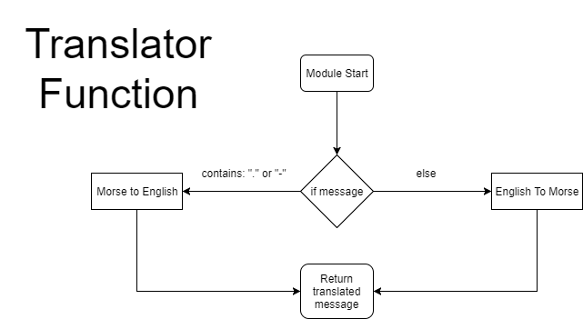
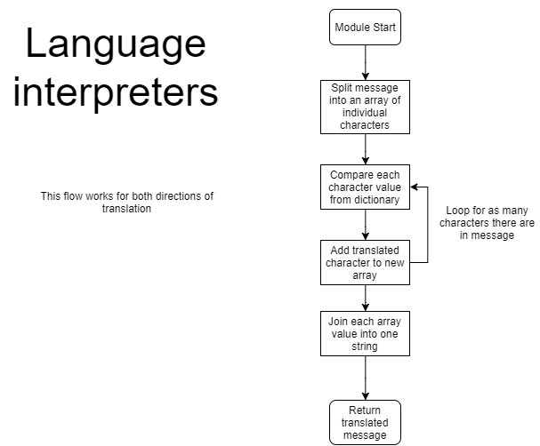
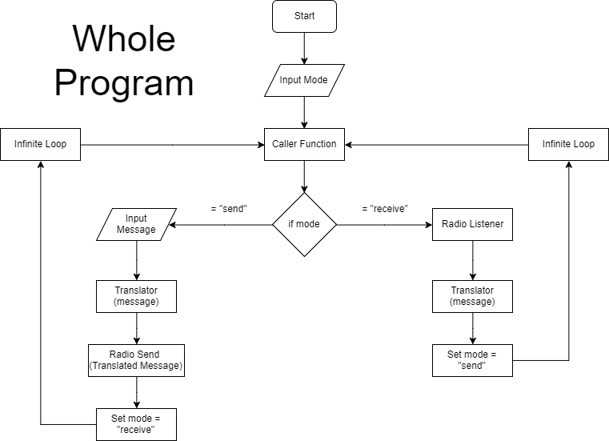

# Micro:morse
Micro:morse is a python based Morse code translator that is in development for a project. The planned features of this script are by order of priority:


- Translate between Morse code and English
- Transmit the translated data over radio using Micro:bits
- Input message data into the Micro:bit via a terminal interface on a computer/laptop
- Allow users to have a conversation over this communication method, this includes:
  - Two way conversation, with both parties having the same code being executed on each one of their Micro:bits

## Usage
In order to test this yourself, you need:
- 2 Micro:bits
- The Mu Python Editor

Mu is an editor that has a built in, Real Time terminal where text input is available for use in scripts. Load `mainFileV2.py` into the editor by executing: `python mainFileV2.py`, this should bring up prompts to choose a mode, you can either type:
- "send"
- "receive"

There must **always** be 1 sender and 1 receiver, the receiver **must** have their side executed first. If this is not insured, and the sender's message is sent the other device will not hear the message and they will be stuck in an infinite loop.

When entering text in English, the input is not case sensitive, any capital letters will be made lower to be lower case. The translated text will be in Morse code with each "letter" being separated by ampersands (&). For example, "Hello World" will be translated into:
```
microbit-morse> python englishToMorseV2.py

Please enter message text: Hello World

....&.&.-..&.-..&---& &.--&---&.-.&.-..&-..
```
The ampersands segment each letter (including spaces) to make the Morse easier to read for both humans the code. Whitespace does have a dictionary value, however its just `" "`, more Whitespace. This is due to the fact that the code could misinterpret the Morse when translating back to English.

Once the English is translated, it is broadcasted **once** via radio in all directions to all devices on the same channel. Since the receiver end is already scanning on an loop, it will pick up the signal and interpret the message, translate it back into English, and display it in the terminal. The sender will not enter receiving mode, likewise, the receiver becomes the sender.  

## Documentation
### About
This project is being developed on Atom by GitHub using Python as the primary language.

The aim of this project is assist military communications officers in translating messages between languages. It does this by doing the translation for the officer as well as sending the data to the receiver.

There are 6 different modules:
- Translation Modules
  - English to Morse
  - Morse to English
- Radio Communications
  - Radio Receiving
  - Radio Sending
- Caller (Main function the user will interact with)

Other major elements of the code are the dictionaries defined at the beginning of the file. These outline all the English and Morse values in both directions. These dictionaries could be changed into other forms of translation, such as ciphers and encrypted messages - all it takes is changing a few values on each device.

The code went through a rough version, this I called "V1" or the legacy version, it does the job, however, more human interaction and coordination is required to get it to work. Version 1, along with it's comments can be viewed in the folder "V1 - Legacy".

### Planning & Design
**Inputs:**
- Keyboard through command line

**Processes:**
- Translation
- Radio communications

**Outputs:**
- Console printing through command line

**Control Structures/Flowcharts**
- Flowcharts can be found along with the code they represent throughout this document.
- Control structures needed for the project
  - Condition-controlled loops
  - Infinite Loops

**Pseudo Code** of the whole program.
```
start
  input mode
  infinite loop
    if mode = "send"
        input message
        messageData = result of translator
        Send radio
        set mode = "receive"
    elif mode = "receive"
        message data = result of radioListen
        translated message = result of translator
        print translated message
        set mode = "send"
end
```
**Trace Table**


### Testing
My original findings from Version 1 were that parameter passing was definitely needed to streamline the program and to keep human interference to a minimum.

Certain bugs that kept cropping up were small, but big mistakes when I wrote the code causing catastrophic errors such as characters that are due to be translated being passed as `None` or `Null` values to the translator module. Due to this, the translator module would spit out errors and, due to the interpreter nature of Python, cause the program to cease to execute. Bugs like this one plagued my mind while writing the code, even when I didn't change anything within the module, a small change in another module could cause this to happen.

### Evaluation
**Updates**
- Updates can be retrieved automatically via GitHub along with changelogs.

**Did it work?**
- The program originally started as a more ambitious project, I had ideas of making the program scalable to more than two Micro:bits. This, unfortunately, could not be achieved with Python alone, or with the Micro:bits primitive data transmission methods.
- As the project developed, I changed the goals I set for the it to achieve, more attainable ones. I'm confident in saying that this project fulfils the plan I laid out in the end.

## Module Details

### Radio Communication Modules
These modules handle message data going in and out of the devies. These include `radioSend()` and `radioListen()`.

The sender is quite straight forward:
```python
def radioSend(data):
    radio.on()
    # Data is entered through the parameter "data" and sent.
    print("Transmitting...")
    radio.send(data)
```
However, the listener is a bit more complex:
```python
def radioListen():
    radio.on()
    print("Scanning...")
    while True:
        # Scans until different data other than "None" is heard.
        data = radio.receive()
        if data != None:
            break

    print("Received.")
    # Return the data retrieved from radio as the result of the function.
    return data
```

### Translation Modules
These modules handle the translation of data between Morse and English. These include `englishMorse()`, `morseEnglish()` and `translator()`. The flow is shown below:


<br>
<br>
<br>


This is the English to Morse module:
```python
def englishMorse(message):
    # Data entered through parameter "message"
    # Make input lower case
    message = message.lower()
    # List each character as an array of characters
    array = list(message)

    newString = []
    # Loop the comparison of individualised English characters with their value in Morse
    i = 0
    while i < len(array):
        # Add each new Morse value to a new array of morse characters
        newString.append(englishToMorse.get(array[i]))
        i += 1
    # Join each arrat value into one string
    translatedString = "&".join(newString)

    return translatedString
```
This is the Morse to English module:
```python
def morseEnglish(message):
    # Data entered through parameter "message"
    # Split each Morse chracter by the spaces between them
    array = message.split("&")

    newString = []
    # Loop the comparison of individualised Morse characters with their value in English
    i = 0
    while i < len(array):
        # Add each translated value to a new array
        newString.append(morseToEnglish.get(array[i]))
        i += 1
    # Join each arrat value into one string
    translatedString = "".join(newString)

    return translatedString
```
and this is the translator function:
```python
def translator(message):
    # Data entered through parameter "message"
    # If the code detects elements of Morse in "message" then it runs the Morse to English translator.
    if "-" in message or "." in message:
        translatedMessage = morseEnglish(message)
    else:
        translatedMessage = englishMorse(message)
    # Return the translatedMessage as the result of the function.
    return translatedMessage
```
The `translator()` function is what links the two language modules together, it determines which one to use based on the contents on the message.
### Dictionary Modules
 The dictionary modules server as a reference for the script to translate the user input into another language/code. Both dictionaries are actual dictionary methods that contains keys and values. The keys are used as references when translating the user input characters into the corresponding language/code.
```python
newString = []
# Loop the comparison of individualized characters with their value in the target language.
i = 0
while i < len(newArray): # Loops based on number of characters in the array.
    # Add each new Morse value to a new array of Morse characters
    newString.append(dictionary.get(newArray[i]))
    i += 1
```
`.get()` is the method for reading key values and returning their corresponding values in a dictionary. This is looped for every character in the array from the `userInput`. This method is the same for both `englishMorse()` and `morseEnglish()`.

### Caller Module - _"Where the magic happens"_
The caller module is where the program starts, its where the user decides what mode to use and from there the program blossoms into many different branches of modules. But they all lead back to this one function.



```python
def caller():
    # Define mode
    mode = input("send or receive? ")
    # Keeps the whole program looped infinitely
    while True:
        # Uses "mode" to determine to send or receive.
        if mode == "send":
            # Runs text input and translation functions if sending.
            text = input("Input message text: ")
            messageData = translator(text)
            radioSend(messageData)
            # Changes mode to receive.
            mode = "receive"
        if mode == "receive":
            # Sets givenData to whatever the result of radioListen() is.
            givenData = radioListen()
            # Takes givenData and uses it as a parameter in the translator function.
            translatedData = translator(givenData)
            print(translatedData)
            # Changes mode to send.
            mode = "send"
```
